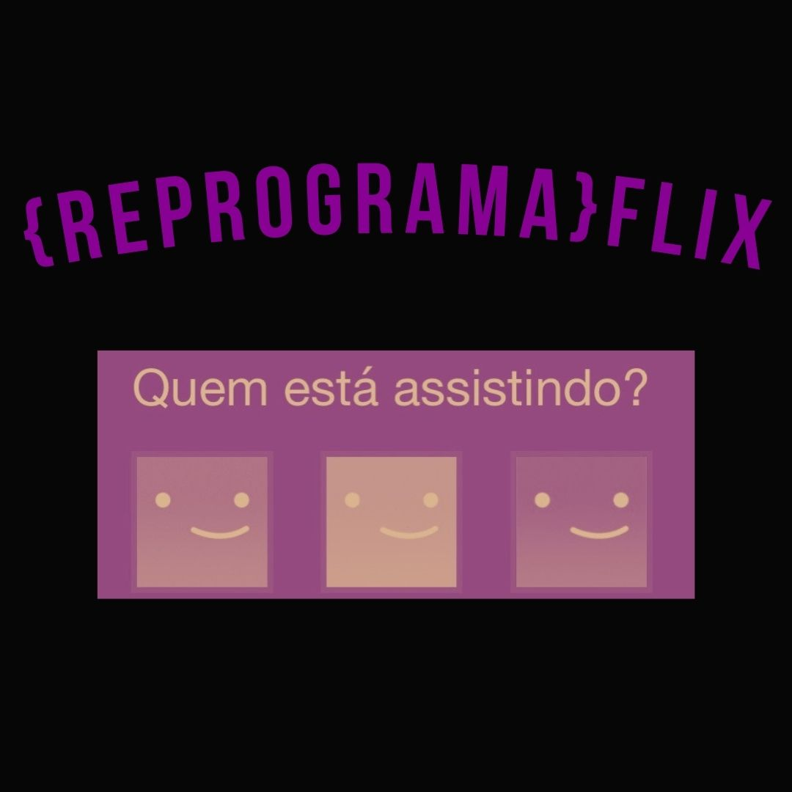

# **{ Reprograma }** - **#TodasEmTech** - **Back-end**
# **Semana 12 :** Introdução ao Banco de Dados e Integração

Olá, nessa semana, com a profa Tereza Cristina, começamos a imersão no mundo dos dados, entendendo desde conceitos de Abstração até conseguirmos manipular/criar banco de dados com novas tecnologias como o MongoDB Atlas e o nosso Rôbo 3T. Como resultado dos estudos dessa semana foi feita uma API de séries integrada ao banco de dados no MongoDB, com as funcionalidades de um CRUD completo, seguindo nossa arquitetura MVC, esse projeto se encontra na branch "Branch-API-Reprogramaflix" deste repositório. 
#

## **O que aprendemos?**

- **Conceitos :** dados e banco de dados ;
- **Abstração :** coleções, entidades e atributos
- **SQL e NoSQL :** tipos, modelos, estruturas, armazenamento, usos e prática ;
- **MongoDB :** conceitos, instalação, configuração e prática) ;
- **Integração :** API com Banco de Dados ;
- **Prática com novas tecnologias :** MongoDB e Robô 3T


#

## **Projeto API {Reprograma}flix**

Como resultado final dos estudos dessas semanas , desenvolvemos o projeto de uma API de séries, sendo um CRUD completo integrado/conectado ao nosso banco de dados no MongoDB.




#

## **Passo a Passo** 


Roteirizando brevemente as etapas da realização do projeto desse semana, seguem as etapas de construção do projeto:


**1.** Forkar esse repositório [AQUI](https://github.com/reprograma/On16-TodasEmTech-S12-Intro-BD), clonar na nossa máquina, ir para a pasta do projeto e criar uma nova Branch:

```js
 cd reprogramaflix-API-DB

 git checkout -b Branch-API-Reprogramaflix
``` 

**2.** Instalar dependências e organizar a arquitetura do projeto, segundo o modelo de arquitetura MVC ( criando no projeto a estrutura com as pastas *models*, *routes*, *controller*, *config* dentro da pasta *src*)
  
```js
 npm init

 npm install express --save

 npm install nodemon --save

 npm install mongoose
``` 

**3.** `SRC` : Na pasta *config* criar o arquivo *dbConnect.js*, contendo o código para importar o mongoose, conectar nosso banco de dados MongoDB através da nossa string de conexão e exportar para o arquivo *app.js*:

```js
mongoose.connect("mongodb+srv://nossoUser:<senha>@cluster0.tgb2lsm.mongodb.net/nomeDoNossoBancoDeDados");

let db = mongoose.connection;

module.exports = db;
```  

**4.** No arquivo *app.js* vamos centralizar o conteúdo da nossa aplicação:  **Importar** o arquivo *dbConnect.js*, **verificação de erro ou sucesso** da nossa conexão com o banco de dados, e **determinando nossa rota raiz** do projeto, e exportando:

```js
const db = require("./config/dbConnect.js")
```

```js
db.on("error", console.log.bind(console, 'Erro de conexão'))
db.once("open", () => {
    console.log('Conexão com o banco feita com sucesso')
});
```

```js
app.use("/", index);
app.use("/reprogramaflix", series);
```
**5.** `SRC` : Na pasta *models* vamos **criar nossa Schema** ( um objeto JSON que define a estrutura e o conteúdo dos seus dados ) no arquivo *series.js* , **declarar uma variável e exporta-la**:
```js
const seriesSchema = new mongoose.Schema({
  id: { type: String },
  titulo: { type: String, required: true },
  genero: { type: String, required: true },
  sinopse: { type: String, required: true },
  favoritada: { type: Boolean }  
});
```

```js
const series = mongoose.model('series', seriesSchema);

module.exports = series;
```

**6.** `SRC` : Na pasta *routes* criamos os arquivos *index.js* e *seriesRoutes.js* , contendo o **caminho das nossas rotas** ( GET, PUT, POST e DELETE ) , e exportamos as rotas  :
  

```js
// index.js

router.get("/", function (req, res) {
    res.status(200).send({
        title: "Reprograma - On16 Semana 12 - Intro BD - API Reprogramaflix com DB",
        version: "1.0.0"
    })
});
```

```js
// seriesRoutes.js

router.get("/series", controller.getAllSeries)

router.get("/series/:id", controller.getSerieById)

router.put("/series/atualizar/:id", controller.updateSeries)

router.post("/novaserie", controller.createSeries)

router.delete("/series/delete/:id", controller.deleteSerieById)
```

**7.** `SRC` : Na pasta *controllers* temos o arquivo *seriesController.js* onde criaremos as funções com a lógica das nossas funcionalidades/verbos, e as refatoramos , por fim, exportamos todas nossas funções para **listar** (GET) , **criar** (POST) , **atualizar** (PUT) e **deletar** (DELETE) :

```js
// GET - listar

const getAllSeries = (req, res) => {
    series.find((err, series) => {
        res.status(200).json(series);
    })
};
```

```js
// GET - listar por Id

const getSerieById = (req, res) => {
    const id = req.params.id;

    series.findById(id, (err, series) => {
        if (err) {
            res.status(400).send({
                message: `${err.message} - id da série não encontrada`
            })
        } else {
            res.status(200).send(series);
        }
    })
}

```

```js
// POST - Criar

const createSeries = (req, res) => {
    let serie = new series(req.body);

    serie.save((err) => {
        if (err) {
            res.status(500).send({
                message: `${err.message} - falha ao cadastrar nova série`
            })
        } else {
            res.status(201).send(series.toJSON())
        }
    })
};

```

```js
// PUT - Atualizar

const updateSeries = (req, res) => {
    const id = req.params.id;

    series.findByIdAndUpdate(id, {
        $set: req.body
    }, (err) => {
        if (!err) {
            res.status(200).send({
                message: 'Série atualizada com sucesso!'
            })
        } else {
            res.status(500).send({
                message: err.message
            })
        }
    })
};

```

```js
// DELETE - deletar

const deleteSerieById = (req, res) => {
    const id = req.params.id;

    series.findByIdAndDelete(id, (err) => {
        if (!err) {
            res.status(200).send({
                message: 'Série deletada com sucesso'
            })
        } else {
            res.status(500).send({
                message: err.message
            })
        }
    })
};


```

**8.** No arquivo *server.js* iremos **configurar nossa porta** e **iniciar nosso servidor** :

```js
const app = require('./src/app')
const PORT = 7070
```

```js
app.listen(PORT, () => {
    console.log(`Seu servidor está na porta ${PORT}`)
})
```
**9.** Agora que finalizamos vamos de `npm run start`  esperar para checar se o servidor está rodando e confirmar a conexão do nosso projeto de API com nosso banco de dados de séries no MongoDB.


**10.** Tudo ok? Então vamos **checar mudanças** , **adicionar**, **commitar** e dar **push** após cada configuração/alteração/criação do nosso projetinho na nossa branch :

```js
git status # On branch Branch-API-Reprogramaflix

git add <nomearquivo>

git commit -m "descrição da implementação"

git push origin Branch-API-Reprogramaflix

```

**11.** Por fim, tudo certinho e vamos testar/brincar um pouquinho com nossas funcionalidades e dados no **Postman** e no **Robô T3**


#

## E por enquanto é só , semana que vem tem mais !!!

