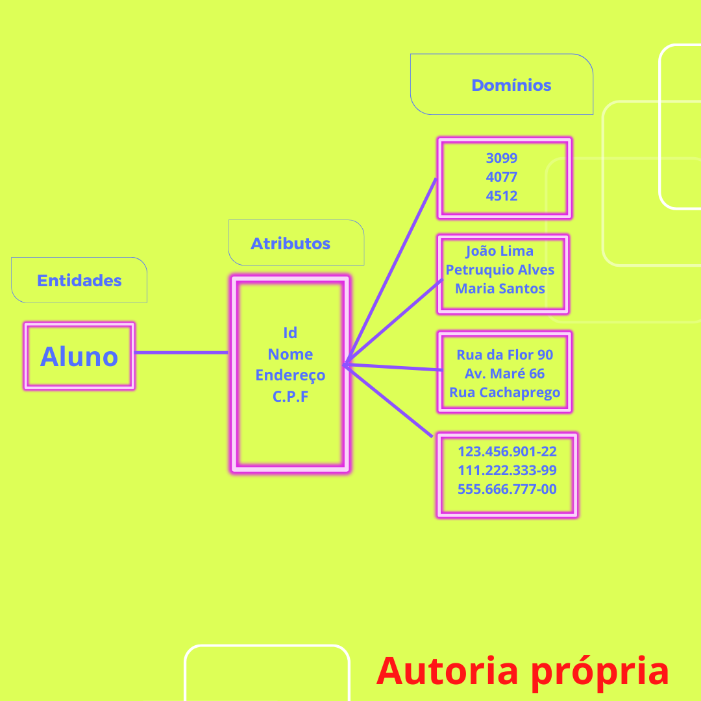

# INTRODUÇÃO AO BANCO DE DADOS 


# SEMANA 12 - 

# Aula Ministrada por Tereza Oliveira


<p>Fonte: Gif www.imagensanimadas.com</p>

#### O que aprendi 🛰️

* Biblioteca mongoose;
* 

#### Qual a diferença entre DADOS & INFORMAÇÕES?
- Dados podem ser qualquer contéudo p.exemplo: números, valores, medições, cpf, horários, localidade etc... Estes contéudos por si só não tem nenhum valor agregado, não se consegue tomar nenhuma decisão ou mesmo orientação.

- Informações é o resultado do tratamento do dado,  ou seja o valor real da coleta após a análise do contéudo quantificado  que  o dado tem. Na etapa do tratamento apura-se as mensagens transmitidas dos dados, para que isto ocorra tem que organizar e ordenar os dados e processar os dados. Para esta fase o uso do sistemas de gestão, são os grandes aliados.

#### O que são Entidades, Relacionamento, Atributos e Dominios?
- Entidades é um objeto que existe e é distinguível de outros objetos, tem algum significado, e sobre o qual é necessário guardar informação.Uma entidade é representada por um conjunto de atributos.

- Relacionamento é uma associação entre várias entidades e representa a maneira como essas entidades podem estar logicamente relacionadas.

- Atributos é uma função que mapeia um conjunto de entidades num domínio e identifica, qualifica e descreve esse conjunto de entidades. 

Domínio é o conjunto de valores possíveis de um atributo.

Tipos de atributos:

Atributos Atómicos – Não é possível dividi-los em vários campos. Ex: peso, preço unitário…
Atributos Compostos – É possível decompor o atributo em vários. Ex: Nome, Morada.
Atributos Identificadores – Identifica inequivocamente um registo numa entidade. Ex: BI, Matricula.
Atributos candidatos – Estão em condições de ser chave primária. Ex: Nº contribuinte.
Chave estrangeira ou externa.

Exemplo de entidades, atributos e domínios:





# On16-TodasEmTech-S12-Intro-BD

Olá, sejam bem-vindas a aula de banco de dados e integração! Meu nome é Tereza Oliveira (@Tereza25), e irei acompanhar vocês nessa semana.

### Vamos preparar o ambiente!


Para executar este projeto, você deverá ter instalado o Node.js e as dependências do npm. Além disso, iremos fazer requisições na API com a plataforma Postman.

Seguiremos a ordem de instalações no terminal:

- `$ npm init`
- `$ npm install express --save`
- `$ npm install nodemon --save`


Este projeto já está com os métodos HTTP organizados. Você pode testar as rotas Get, Post, Update e Delete através da ferramenta Postman. 

O próximo passo agora é refatorar o código do nosso projeto e criar o processo de integração com o banco de dados MongoDB através da biblioteca `mongoose`. 


-------------------------------

### Cadastrando MongoDB Atlas

Neste projeto iremos utilizar a GUI MongoDB Atlas para gerenciar nosso banco de dados, será necessário fazer o cadastro no site oficial [MongoDB Atlas](https://www.mongodb.com/atlas/database), cadastrar um usuário e optar pela modalidade shared(pública) com o provedor de sua escolha. 

Após seguir o passo a passo de configuração de cluster e projeto, será necessário cadastrar um usuário e senha para criar seu database. Não esqueça de anotar e guardar a senha em local seguro.  

Após a criação do database, você já pode clicar em `connect`, como vamos usar nossa própria aplicação, clique em “Connect your aplication”. Será gerada um endereço de localhost, copie e esse endereço pois em breve iremos utilizá-lo. 


-------------------------------

### Iniciando com Mongoose

Para conseguirmos conectar o MongoDB no nosso projeto, iremos utilizar a biblioteca [mongoose](https://www.npmjs.com/package/mongoose) , na documentação oficial você tem acesso a sintaxe de configuração, mas fica tranquila e se liga no passo a passo a seguir.

Vamos instalar a Instalar a lib `mongoose` via npm install: 

```js
$ npm install mongoose
``` 

Vamos criar uma pasta chamada `config` e dentro dela, o arquivo `dbConnect.js’.
Dentro do arquivo, iremos importar o mongoose através do require:

```js
const mongoose = require (“mongoose”)
```

Vamos construir nossa sintaxe de conexão. Lembra do string de conexão do MongoDB Atlas? Chegou a hora de usá-la. 

```js 
mongoose.connect( “COLE-AQUI-STRING-DE-CONEXÃO”)
```

**ATENÇÃO! Não esqueça de alterar o campo password para incluir a senha do database que você criou e incluir o nome do database no final da string de conexão..**

Ainda no arquivo `dbConnect.js`, vamos declarar uma variável let chamada `db` e atribuir o valor `mongoose.connect`, finalizamos com a exportação da variável recém declarada.


```js
let db = mongoose.connection;

module.exports = db;
```

Vamos para o arquivo `app.js`. Nossa conexão será importada neste arquivo, ficará da seguinte forma:

```js
const db = require (“./config/dbConnect.js”);
```

Vamos iniciar a sintaxe de conexão:

```js
db.on("error", console.log.bind(console, 'Erro de conexão'))
db.once("open", () => {
  console.log('Conexão com o banco feita com sucesso')
});
```

Agora podemos chamar nosso projeto no terminal, seguindo o script que criamos `npm run start`. O resultado esperado será a mensagem de sucesso para conexão com o banco de dados. 


----------------------------------------------------------------------

### Criando Schema


O MongoDB trabalha com uma estrutura de dados chamada de Schema, um objeto JSON que define a estrutura e o conteúdo de seus dados. 

Iremos alterar a extensão do nosso arquivo `livros.json` para  `livros.js`, dentro do arquivo, iremos modificar toda sintaxe para modelo de schema.

Na primeira linha de comando, vamos importar o mongoose:

```js
const mongoose = require (“mongoose”);
```

Após a importação, vamos declarar uma constante chamada livroSchema, nela iremos atribuir nossa Schema.


```js
const livroSchema = new mongoose.Schema(
  {
    id: {type: String},
    titulo: {type: String, required: true},
    autor: {type: String, required: true},
    editora: {type: String, required: true},
    numeroPaginas: {type: Number}
  }
);
```

Para finalizar o Schema, vamos declarar uma variável chamada livros e atribuir a o valor `mongoose.model('livros', livroSchema)`, duas linhas seguintes fazemos a exportação da variável criada, ficará assim:

```js
const livros = mongoose.model('livros', livroSchema);

module.exports = livros;
```

--------------------------------------------------------------------

### Refatorando CRUD 

Após as alterações da estrutura de dados de JSON para Schema, precisamos refatorar os códigos de cada rota do nosso projeto, poderemos ter acesso ao banco de dados pelo mongoDB Atlas e também pelo postman. 

- *Método Read*: Vamos refatorar a rota Get e usaremos o comando `find` usado para filtrar dados no banco de dados MongoDB.  

```js
const getAllLivros = (req, res) => {
  livros.find((err, livros) => {
    res.status(200).json(livros)
  })
}

const getLivros = (req, res) => {
  const id = req.params.id;

  livros.findById(id, (err, livros) => {
    if(err) {
      res.status(400).send({message: `${err.message} - Id do livro não localizado.`})
    } else {
      res.status(200).send(livros);
    }
  })
}
```

- *Método Create*: Vamos refatorar a rota Post e usaremos a palavra reservada `new` para construir um novo objeto no banco de dados. Será construido um bloco if/else para retornar mensagem de erro e efetuar a inserção de um novo documento no banco de dados MongoDB.  

```js
const createLivros = (req, res) => {
  let livro = new livros(req.body);

  livro.save((err) => {
    if(err) {
      res.status(500).send({message: `${err.message} - falha ao cadastrar livro.`})
    } else {
      res.status(201).send(livro.toJSON())
    }
  })
}
```

- *Método Update*: Vamos refatorar a rota Update, usaremos o comando `find`, dentro do parâmetro colocamos o filtro localizador `id` e  a sintaxe de alteração `$set:` para localizar e alterar o documento. Será construido um bloco if/else para confirmar o status code do processo de no banco de dados MongoDB. 

```js
const updateLivros = (req, res) => {
  const id = req.params.id;

  livros.findByIdAndUpdate(id, {$set: req.body}, (err) => {
    if(!err) {
      res.status(200).send({message: 'Livro atualizado com sucesso'})
    } else {
      res.status(500).send({message: err.message})
    }
  })
}
```

- *Método Delete*: Vamos refatorar a rota Delete, usaremos o comando `find`, dentro do parâmetro colocamos o filtro localizador `id` e uma palavra reservada `err`, será contruido um bloco if/else para confirmar o status code do processo de exclusão do documento no banco de dados MongoDB. 

```js
const deleteLivros = (req, res) => {
  const id = req.params.id;

  livros.findByIdAndDelete(id, (err) => {
    if(!err){
      res.status(200).send({message: 'Livro removido com sucesso'})
    } else {
      res.status(500).send({message: err.message})
    }
  })
}
```

Agora que finalizamos, podemos fazer o teste. 
Crie um novo objeto no postman com o método Post, faça modificações com o Update e requisições de leitura com o Get. Também faça atualização do database no MOngoDB Atlas. O resultado esperado é que haja manipulação de dados da ambas plataformas. 

—-----------------------------------------------------------------

## Atividade para casa

A atividade será em parceria com a API desenvolvida na atividade da aula de revisão semana 11. O objetivo é de seguir o passo a passo de configuração e conexão da API com o MongoDB Atlas, considerando um novo database e collection. 

Passo a passo atividade:

- 1 - Fazer um fork deste repositório.
- 2 - Clone na sua máquina
- 3 - Crie  uma branch com seu nome;
- 4 -  incluir sua API da semana 11 ou outra de sua escolha;
- 5 - Após as configurações e alterações de conexão, realizar os commits e git push 
- 6 - Fazer o pull request, compartilhando o link no Classroom. 


